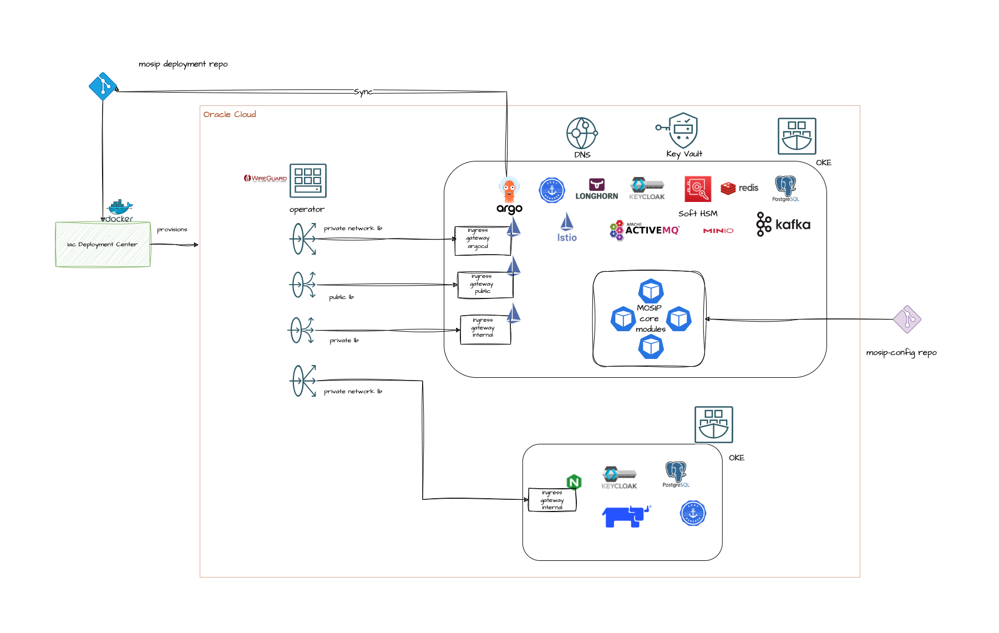

# OCI Installation Guidelines

### Overview

* MOSIP modules are deployed in the form of microservices in a Kubernetes cluster.
* VPN is required for MOSIP operations. The implementer is free to choose the appropriate vpn.[Wireguard](https://www.wireguard.com/) is used as a trust network extension to access the admin, control, and observation pane
* It is also used for on-the-field registrations.
* MOSIP uses OCI load balancers for:
  * SSL termination
  * Reverse Proxy
  * CDN/Cache management
  * Loadbalancing

* Kubernetes cluster is administered using the [Rancher](https://rancher.com/docs/rancher/v1.3/en/kubernetes/#rancher-ui) and [OKE](https://www.oracle.com/in/cloud/cloud-native/kubernetes-engine/)
* In V3, we have two Kubernetes clusters:
  * Observation Cluster - This cluster is a part of the observation plane and it helps in administrative tasks. By design, this is kept independent of the actual cluster as a good security practice and to ensure clear segregation of roles and responsibilities. As a best practice, this cluster or its services should be internal and should never be exposed to the external world.
    * [Rancher](https://rancher.com/docs/rancher/v1.3/en/kubernetes/#rancher-ui) is used for managing the Mosip cluster.
    * [Keycloak](https://www.keycloak.org/) in this cluster is used for cluster user access management.
    * It is recommended to configure log monitoring and network monitoring in this cluster.
    * In case you have a internal container registry, then it should run here.
  * MOSIP Cluster - This cluster runs all the MOSIP components and certain third party components to secure the cluster, API’s and Data.
    * [MOSIP External Components](https://github.com/mosip/mosip-infra/blob/v1.2.0.1-B1/deployment/v3/external/README.md#mosip-external-components)
    * [Mosip Services](https://github.com/mosip/mosip-infra/blob/v1.2.0.1-B1/deployment/v3/mosip/README.md#mosip-services)

  * ArgoCD - The deployment and gitops is handled by ArgoCD(https://argo-cd.readthedocs.io/en/stable/ )

### Deployment Repos
* [mosip-infra](https://github.com/oci-mosip/public-mosip-gitops) : contains deployment scripts to run charts in defined sequence.
* [mosip-config](https://github.com/oci-mosip/mosip-config/tree/oci-v1.2.0.1-B4) : contains all the configuration files required by the MOSIP modules.
* [mosip-helm](https://github.com/mosip/mosip-helm/tree/v1.2.0.1-B1) : contains packaged helm charts for all the MOSIP modules.

### Pre-requisites:

#### Hardware Requirements

VM’s required have any Operating System and can be selected as per convenience.\
In this installation guide, we are referring to `Oracle Linux` throughout.

|   | **Purpose**                         | **vCPU’s** | **RAM** | **Storage (HDD)** | **no. of VM’s** | **HA**                           |
| - | ----------------------------------- | ---------- | ------- | ----------------- | --------------- | -------------------------------- |
| 1 | Wireguard Bastion Host              | 2          | 4 GB    | 50 GB              | 1               | (ensure to setup active-passive) |
| 2 | Rancher Cluster nodes (OCI managed) | 2          | 8 GB    | 50 GB              | 2               | 2                                |
| 3 | Mosip Cluster nodes (OCI managed)   | 8          | 32 GB   | 100 GB             | 6               | 6                                |

#### Network Requirements

* All the VM's should be able to communicate with each other.
* Need stable Intra network connectivity between these VM's.
* All the VM's should have stable internet connectivity for docker image download (in case of local setup ensure to have a locally accesible docker registry).
* During the process, we will be creating two loadbalancers as mentioned in the first table below:
* Server Interface requirement as mentioned in the second table:

| **Loadbalancer**                         | **Purpose**                                                                                                                                                                                                                   |
| ---------------------------------------- | ----------------------------------------------------------------------------------------------------------------------------------------------------------------------------------------------------------------------------- |
| Public loadbalancer MOSIP cluster        | <p>This will be used to access below mentioned services:</p><ul><li>Pre-registration</li><li>Esignet</li><li>IDA</li><li>Partner management service api’s</li><li>Mimoto</li><li>Mosip file server</li><li>Resident</li></ul> |
| Private loadbalancer MOSIP cluster       | <p>This will be used to access all the services deployed as part of the setup including external as well as all the MOSIP services.</p><p>Note: Access is restricted and requires a VPN connection </p>        |

|   | **Purpose VM**         | **Network Interfaces**                                                                                                                                                                                                                                                                            |
| - | ---------------------- | ------------------------------------------------------------------------------------------------------------------------------------------------------------------------------------------------------------------------------------------------------------------------------------------------- |
| 1 | Wireguard Bastion Host | <ul><li>One Private interface: that is on the same network as all the rest of nodes. (Eg: inside local NAT Network )</li><li>One public interface: Either has a direct public IP, or a firewall NAT (global address) rule that forwards traffic on 51820/udp port to this interface ip.</li></ul> |

#### DNS Requirements

DNS zone management will be done in OCI [DNS](https://www.oracle.com/au/cloud/networking/dns/) service

|    | **Domain name**                                                     | **Mapping details**                    | **Purpose**                                                                                                                                                                                                                                     |
| -- | ------------------------------------------------------------------- | -------------------------------------- | ----------------------------------------------------------------------------------------------------------------------------------------------------------------------------------------------------------------------------------------------- |
| 1  | [rancher.sandbox.xyz.net](http://rancher.xyz.net)                           | Load balancer of Observation cluster   | Rancher dashboard to monitor and manage the kubernetes cluster. You can share an existing rancher cluser.                                                                                                                                       |
| 2  | [keycloak-rancher.sandbox.xyz.net](http://keycloak.xyz.net)                         | Load balancer of Observation cluster   | Administrative IAM tool (keycloak). This is for the kubernetes administration.                                                                                                                                                                  |
| 3  | [sandbox.xyz.net](http://sandbox.xyz.net)                           | Private Load balancer of MOSIP cluster | Index page for links to different dashboards of Mosip env. (This is just for reference, Please do not expose this page in a real production or uat environment)                                                                                 |
| 4  | [api-internal.sandbox.xyz.net](http://api-internal.sandbox.xyz.net) | Private Load balancer of MOSIP cluster | Internal API’s are exposed through this domain. They are accessible privately over wireguard channel                                                                                                                                            |
| 5  | [api.sandbox.xyz.net](http://api.sandbox.xyz.net)                   | Public Load balancer of MOSIP cluster  | All the API’s that are publically usable are exposed using this domain.                                                                                                                                                                         |
| 6  | [prereg.sandbox.xyz.net](http://prereg.sandbox.xyz.net)             | Public Load balancer of MOSIP cluster  | Domain name for Mosip’s pre-registration portal. The portal is accessible publicly.                                                                                                                                                             |
| 7  | [activemq.sandbox.xyz.net](http://activemq.sandbox.xyz.net)         | Private Load balancer of MOSIP cluster | Provides direct access to activemq dashboard. Its limited and can be used only over wireguard                                                                                                                                                   |
| 8  | [kibana.sandbox.xyz.net](http://kibana.sandbox.xyz.net)             | Private Load balancer of MOSIP cluster | Optional instalation. Used to access kibana dashboard over wireguard                                                                                                                                                                            |
| 9  | [regclient.sandbox.xyz.net](http://regclient.sandbox.xyz.net)       | Private Load balancer of MOSIP cluster | Regclient can be downloaded from this domain. It should be used over wireguard.                                                                                                                                                                 |
| 10 | [admin.sandbox.xyz.net](http://admin.sandbox.xyz.net)               | Private Load balancer of MOSIP cluster | Mosip’s admin portal is exposed using this domain. This is an internal domain and is restricted to access over wireguard                                                                                                                        |
| 11 | [minio.sandbox.xyz.net](http://minio.sandbox.xyz.net) | Private Load balancer of MOSIP cluster | Optional- This domain is used to access the object server. Based on the object server that you choose map this domain accordingly. In our reference implementation Minio is used and this domain lets you access Minio’s Console over wireguard |
| 12 | [kafka.sandbox.xyz.net](http://kafka.sandbox.xyz.net)               | Private Load balancer of MOSIP cluster | Kafka UI is installed as part of the Mosip’s default installation. We can access kafka ui over wireguard. Mostly used for administrative needs.                                                                                                 |
| 13 | [iam.sandbox.xyz.net](http://iam.sandbox.xyz.net)                   | Private Load balancer of MOSIP cluster | Mosip uses an Openid connect server to limit and manage access across all the services. The default installation comes with Keycloak. This domain is used to access the keycloak server over wireguard                                          |
| 14 | [postgres.sandbox.xyz.net](http://postgres.sandbox.xyz.net)         | Private Load balancer of MOSIP cluster | This domain points to the postgres server. You can connect to postgres via port forwarding over wireguard                                                                                                                                       |
| 15 | [pmp.sandbox.xyz.net](http://pmp.sandbox.xyz.net)                   | Public Load balancer of MOSIP cluster  | Mosip’s partner management portal is used to manage partners accessing partner management portal over wireguard                                                                                                                                 |
| 16 | [resident.sandbox.xyz.net](http://resident.sandbox.xyz.net)         | Public Load balancer of MOSIP cluster  | accessident resident portal publically                                                                                                                                                                                                          |
| 17 | [esignet.sandbox.xyz.net](http://idp.sandbox.xyz.net)               | Public Load balancer of MOSIP cluster  | accessing IDP over public                                                                                                                                                                                                                       |
| 18 | [smtp.sandbox.xyz.net](http://smtp.sandbox.xyz.net)                 | Private Load balancer of MOSIP cluster | Accessing mock-smtp UI over wireguard                                                                                                                                                                                                           |

**Note:**

* Only proceed to DNS mapping after the ingressgateways are installed and the load balancer is already configured.
* The above table is just a placeholder for hostnames, the actual name itself varies from organisation to organisation.

#### Certificate requirements

As only secured `https` connections are allowed via nginx server, you will need the below mentioned valid ssl certificates:

* SSL certificate related to domain used for accessing MOSIP cluster which will be created using [cert-manager](https://cert-manager.io/). In above e.g. \*.[sandbox.xyz.net](http://sandbox.xyz.net/) is the similiar example domain.

#### Deployment diagram



### Installation

The entire deployment is automated with minimum human intervention. At the end of the deployment 
   - MOSIP OKE cluster will be created along with the mosip deployment modules
   - Rancher will deployed in Observation cluster along with keycloak integration
   - MOSIP cluster will be imported into Rancher
   - Wireguard vpn will be installed and ready to use.
   - All DNS zone records will be updated.
   - ArgoCD will manage the application deployment
   - Secrets management will be done by OCI vault service
   

#### Prerequisite for complete deployment in Personal Computer
-   Install Docker
-   Generate admin user api keys as per [OCI Docs](https://docs.oracle.com/en-us/iaas/Content/API/Concepts/apisigningkey.htm#two)
-   Capture the values for
    - user_id
    - tenancy_id
    - fingerprint
    - region
    - private_key
-   Create a customer secret key for storing terraform state in remote bucket as per [OCI Docs](https://docs.oracle.com/en-us/iaas/Content/Object/Tasks/s3compatibleapi.htm#usingAPI)

   ```bash
      ## Create S3 compatible api secret and key
      oci iam customer-secret-key create \
          --display-name mosip-terragrunt-s3 \
          --user-id ocid1.user.oc1..aaaaaaaak | \
          jq -r '.data | "AWS_ACCESS_KEY_ID=\(.id)\nAWS_SECRET_ACCESS_KEY=\(.key)"'

      e.g
      AWS_ACCESS_KEY_ID=39445a5f23a9aeec4xxxxxxx
      AWS_SECRET_ACCESS_KEY=PbcqJt9iL2P7j7xxxxxxxxw=

      ## Get the region code
      export REGION=$(
          oci iam region-subscription list | \
          jq -r '.data[] | select(.["is-home-region"] == true) | .["region-name"]'
      )

      ## Get the object storage namespace
      export OCI_OSS_NS=$(oci os ns get | jq -r '.data')

      ## S3 compatible api endpoint
      export OCI_S3_ENDPOINT=https://${OCI_OSS_NS}.compat.objectstorage.${REGION}.oraclecloud.com
      
   ```
-   Create bucket for storing terraform state files

   ```bash
      ## Create object storage bucket for storing terraform state files
      export BUCKET_NAME=$(
          oci os bucket create \
              -c ocid1.compartment.oc1..aaaaaaaand \
              --name mosip_terragrunt_state_bucket | \
          jq -r '.data.name'
      )
   ```
-   Create DNS zone in OCI and delegate the zone control
   ```bash
      ## Create DNS Zone
      export ZONE_ID=$(
          oci dns zone create \
              -c ocid1.compartment.oc1..aaaaaaaand \
              --name sandbox.xyz.net \
              --zone-type PRIMARY | \
          jq -r '.data.id'
      )

   ```

-   Delegate a DNS zone from your DNS registrar to OCI public DNS as per [Docs](https://blogs.oracle.com/cloud-infrastructure/post/delegate-dns-zone-oci-public-dns)

-   Create software Vault and master vault encryption key in OCI
   ```bash
      ## Create KMS Vault for Secrets Management
      export VAULT_ID=$(
          oci kms management vault create \
              -c ocid1.compartment.oc1..aaaaaaaanq \
              --display-name mosip-dev-vault \
              --vault-type DEFAULT | jq -r '.data.id'
      )

      ## Get the vault management endpoint
      export MANAGEMENT_ENDPOINT=$(
          oci kms management vault get \
              --vault-id $VAULT_ID | jq -r \
              '.data | select(.["lifecycle-state"] == "ACTIVE") | .["management-endpoint"]'
      )

      ## Create a master encryption key
      export MASTER_ENC_KEY=$(
          oci kms management key create \
              --compartment-id ocid1.compartment.oc1..aaaaaaaa \
              --display-name master-enc-key \
              --key-shape '{"algorithm":"AES","length":"32"}' \
              --endpoint $MANAGEMENT_ENDPOINT \
              --protection-mode SOFTWARE | jq -r '.data.id'
      )

   ```


#### Deployment control center

The deployment consists of two parts
  - OCI infra provision (terraform)
  - MOSIP application deployment ( ansible )

The entire deployment is done from a docker container. This container has all the pre requisite softwares, like terragrunt, opentofu, oci ansible collections etc. The terraform state is stored in an object storage bucket. Even if the container get removed, the infra state file is still intact. The user just needs docker installed and they are good to go.

First, clone this repository to your local machine.

   ```bash
   git clone https://github.com/oci-mosip/public-mosip-gitops.git -b mosip-document
   cd public-mosip-gitops/docker-compose
   ```

Start the deployment control center

   ```bash
   docker compose up -d --build
   ```

If docker compose is not available

   ```bash
      docker build -t mosip-control-center . && \
      docker run -d \
      --name mosip-control-center \
      --entrypoint "sh" \
      mosip-control-center -c "tail -f /dev/null"
   ```

Set Environment Variables

   ```bash
    docker exec -it mosip-control-center /bin/bash

    cd /iac-run-dir
    # modify environment variables in setenv from the pre requisite step
    # REMOTE_STATE_S3_REGION
    # REMOTE_STATE_S3_BUCKET
    # REMOTE_STATE_S3_ENDPOINT
    # AWS_REGION
    # AWS_ACCESS_KEY_ID
    # AWS_SECRET_ACCESS_KEY
    # AWS_ENDPOINT_URL_S3
    # TF_VAR_tenancy_ocid
    # TF_VAR_region
    # TF_VAR_user_ocid
    # TF_VAR_fingerprint
    # TF_VAR_private_key
    source setenv
    ./init.sh
   ```

Update the terraform variables & execute

   ```bash
    docker exec -it mosip-control-center /bin/bash
    cd /iac-run-dir
    source setenv
    cd /iac-run-dir/public-mosip-gitops/terragrunt/mosip/dev

    # Update the environment.yaml
    env: "dev"
    region: ""                                         ## update region       
    home_region: ""                                    ## update home region
    domain: "sandbox.xyz.net"                          ## update the domain name
    tenancy_id: "ocid1.tenancy.oc1..aaaaaaaa"
    compartment_id: "ocid1.compartment.oc1..aaaaaaaa"  ## update the compartment id
    vault_id: "ocid1.vault.oc1...."                    ## update the VAULT_ID as created earlier 
    vault_enc_key_id: "ocid1.key.oc1..."               ## update the MASTER_ENC_KEY as created earlier
    tags:
    {
       "Project": "MOSIP-Dev",  
       "generic/owner": "FirstName-LastName",
    }
    k8s_cluster_properties:
       cluster_name: mosipdev     

   # Start provisioning
    docker exec -it mosip-control-center /bin/bash
    cd /iac-run-dir
    source setenv
    cd /iac-run-dir/public-mosip-gitops/terragrunt/mosip/dev
    ./run.sh     
   ```

**Setup Wirguard VM and wireguard bastion server:**

The infra provisioning will create the bastion vm and start the docker container for wireguard.


**Setup VPN Client in your laptop**

**Setup Wireguard Client in your PC**

* Install [Wireguard client](https://www.wireguard.com/install/) in your PC.
* Assign `wireguard.conf`:
  * SSH to the wireguard server VM.
  * `cd /etc/mosip_wg/`
  * assign one of the PR for yourself and use the same from the PC to connect to the server.
    * create `assigned.txt` file to assign the keep track of peer files allocated and update everytime some peer is allocated to someone.
      * ```java
        peer1 :   peername
        peer2 :   xyz
        ```
    * Use `ls` cmd to see the list of peers.
    * get inside your selected peer directory, and add mentioned changes in peer.conf:
      * `cd peer1`
      * `nano peer1.conf`
        * Delete the DNS IP.
        * Update the allowed IP's to subnets CIDR ip . e.g. 10.10.20.0/23
      * Share the updated `peer.conf` with respective peer to connect to wireguard server from Personel PC.
* add `peer.conf` in your PC’s `/etc/wireguard` directory as `wg0.conf`.
* start the wireguard client and check the status:
  * ```java
    sudo systemctl start wg-quick@wg0
    sudo systemctl status wg-quick@wg0
    ```
* Once Connected to wireguard you should be now able to login using private ip’s.


